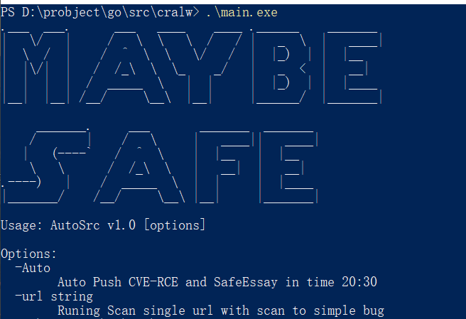
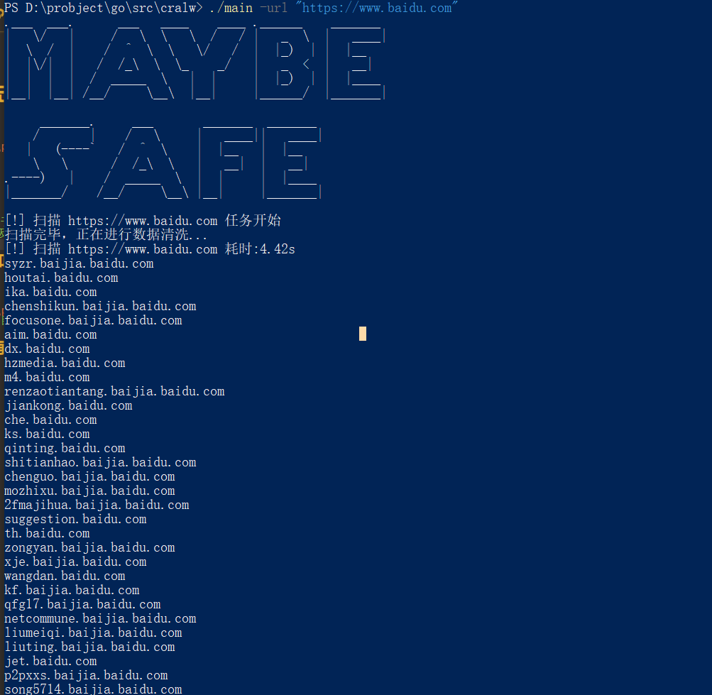
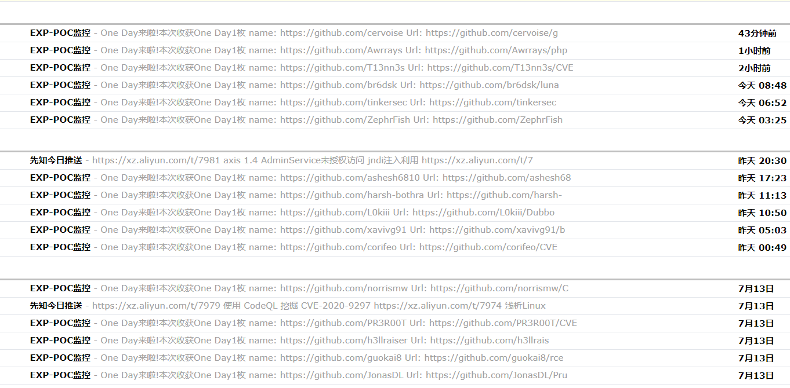

# 疫情期间在家无事写了一个小玩具

## Options 参数


## 子域名扫描
```cmd
./SafeScan.exe -url "url"
```
`` 如需要收集更多信息，请于项目根目录下config.yml修改API相关KEY ``
`` 扫描速度较慢(算法太垃圾，如果有兴趣的师傅可以一起来交流 --- ``


## github监控和先知文章推送
```cmd
./SafeScan.exe -Auto
```

`` 注意此功能需要在项目根目录的config.yml修改gmail相关信息 ``

## 后续功能看情况再添加 （各功能模块没进行兼容，所以只开启两个功能模块， 懒--__--


### 待兼容功能模块

	* [ ] 漏洞扫描 
	* [ ] POC框架
	* [ ] 子域名自动监控系统
	* [ ] ip资产收集（端口扫描，nmap模块，zoomeye， shodan， fofa
	* [ ] 主动扫描

### 待完成功能模块
	* [ ] 厂商漏洞监控
	* [ ] WEB界面
	* [ ] 漏洞库监控
	* [ ] 指纹检测
	* [ ] bypass
	* [ ] fuzzing
