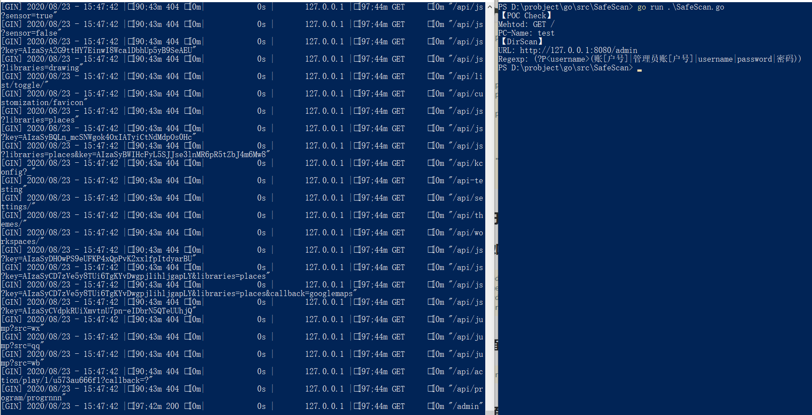

# 关于POC-Yaml模板函数（有两种写法）

#### [第一种可参考Xray](https://docs.xray.cool/#/guide/poc)

## 第二种

```
response.status -> old

response.body.bcontains(b"??") 
==> bcontains(b"??", response.body)

response.headers["??"] == "??" ==> old

response.headers["??"].contains("??")
==> contains("??", response.headers["??"])

"??".bmatches(response.body)
==> bmatches(response.body, "??")

```

### 对于模板解析我增加了一些自定义检测模板，实现自定义扫描，~~后面会增加代码执行模板~~
#### 例如对目录进行扫描，探测是否有信息泄露或者其他（默认请求码为200）
```
[module demo]
name: dirscan-yaml-backstage
wordlist: .\wordlist\test.txt
search: (?P<username>(账[户号]|管理员账[户号]|username|password|密码))

```

### 下面是我对测试服务器的扫描
 

# 常规扫描（未优化和测试，可能存在漏报和未扫出）

## 框架扫描

- [x] fastjson 
- [ ] thinkphp
- [x] struts2

## 通用扫描

- [ ] sql注入检测
- [ ] 命令/代码注入检测
- [ ] 反射性xss检测
- [ ] 目录枚举检测

# 关于Fuzzing的想法

## module demo

```yaml
name: fuzz-params
rule: /{{param}}=${value}$/
regexp: (?P<param>[\w-]+)=(?P<value>[\w%]*)
```

{{**}} 括起来的就是需要fuzz的字段

